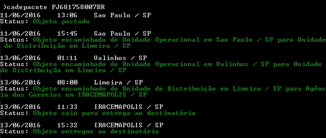

Languages: English  [Portuguese](README.md)

# Description

`cadepacote` is a NodeJS package, for consult Brazil mail package in a fast and simple way, directly with Terminal.



# Install

Install globally package:

```
$ npm install -g cadepacote
```

# How to use

Syntax to use:

```
$ cadepacote <package code> [-r] [-v]
```

Ex:

```
$ cadepacote PJ123456789BR -v
```

# Parametters

- `-v` = Verbose
- `-r` = Reverse list itens

## Support

Node v4.x