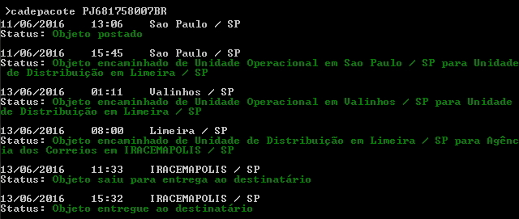

Languages: [English](README-en.md)  Portuguese

# Descrição

`cadepacote` é um pacote de NodeJS, feito para consultar pacote de Correios de uma forma rápida e simples diretamente pelo Terminal.



# Instalar

Instale o pacote globalmente:

```
$ npm install -g cadepacote
```

# Como Usar

Sintaxe de uso:

```
$ cadepacote <codigo pacote> [-r] [-v]
```

Ex:

```
$ cadepacote PJ123456789BR -v
```

# Parametros

- `-v` = Verbose
- `-r` = Reverter itens da lista

## Suporte

Node v4.x